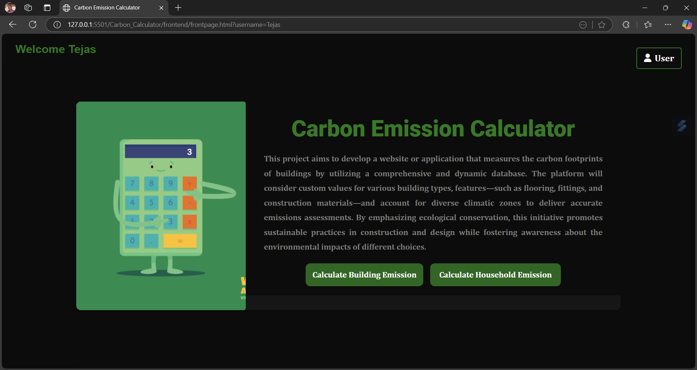
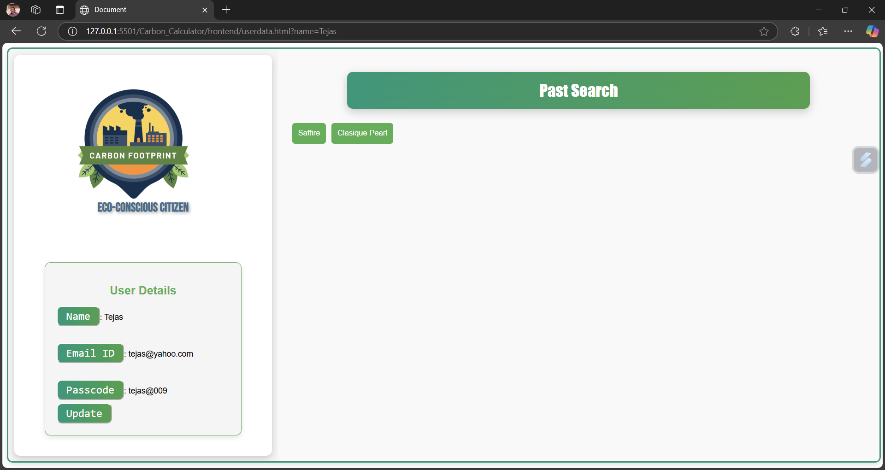
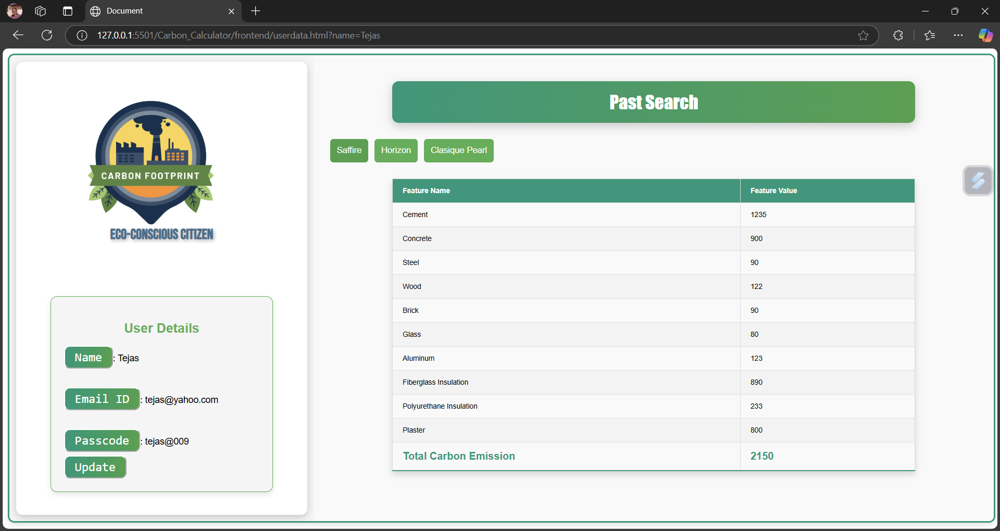
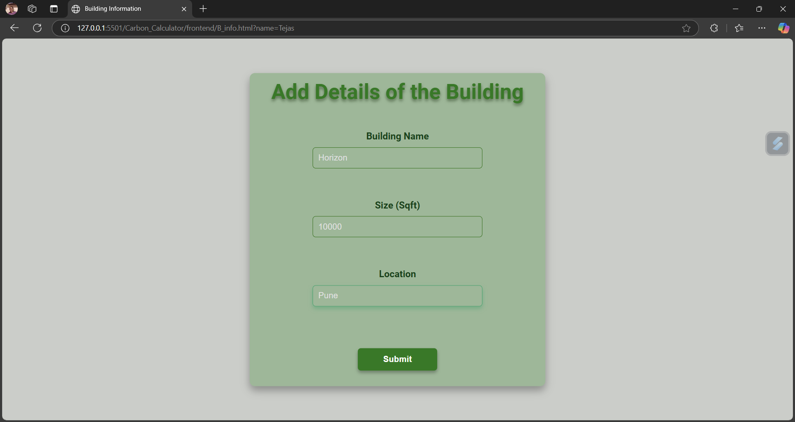
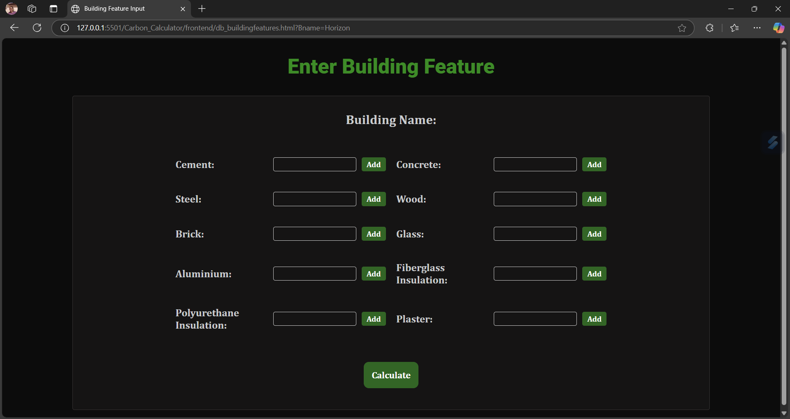
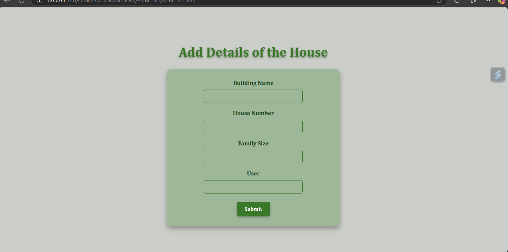
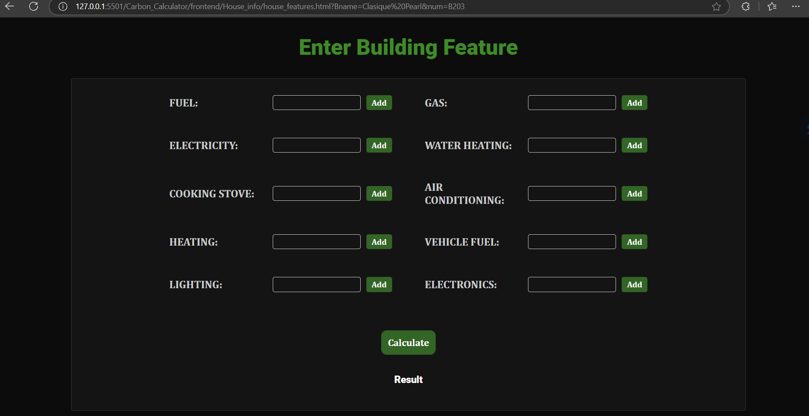

# 🌱 Carbon Calculator — Sustainable Construction & Living

**Carbon Calculator** is a dual-purpose web application that estimates carbon emissions for **buildings** and **households** based on real-world usage of construction materials and home utilities. Built for environmental consciousness, it enables users (especially building constructors or homeowners) to **track**, **log**, and **revise** their carbon footprint through an intuitive dashboard.

---

## 🚀 Features

### 🏢 Building Emission Calculator
- Choose materials like **cement, bricks, steel**, etc.
- Input quantities used in your construction.
- Uses **predefined carbon emission factors** to calculate total emissions.
- Save each building with a unique name to track separately.

### 🍳 Household Emission Calculator
- Estimate emissions from **daily cooking, energy usage**, and utilities.
- Tailored specifically for individual homeowners and tenants.

### 🔐 User Portal
- Sign up and **log in** securely.
- View all submitted entries.
- Click on a building/entry to **update values directly** from the dashboard.
- Recalculation happens in real-time on edit.

### 📊 History & Logging
- Every submission is **stored** and accessible later.
- Users can monitor emission changes **after reducing material use**.

---

## 🌍 Tech Stack

| Layer         | Technology          |
|---------------|---------------------|
| 🔧 Backend     | MySql + Express   |
| 🧠 Database    | MySql  |
| 🎨 Frontend    | HTML + JS      |
| 💅 Styling     | CSS       |
| 🧮 Logic       | Custom Functions |


---

## 🖼️ Screenshots

1. **Landing Page**
   

2. **User Dashboard**
   
   
3. **User Dashboard Porject view and dynamic updates**
   

4. **Building Details**
   
   
5. **Building Calculator Form**
   

6. **Building Details**
   
   
7. **Building Calculator Form**
   

---

## 📁 Folder Structure Overview

```bash
CarbonCalculator/
│
├── frontend/
|
├── backend/
│   ├── server.js
│   ├── database.js
│
├── Content/
└── README.md
